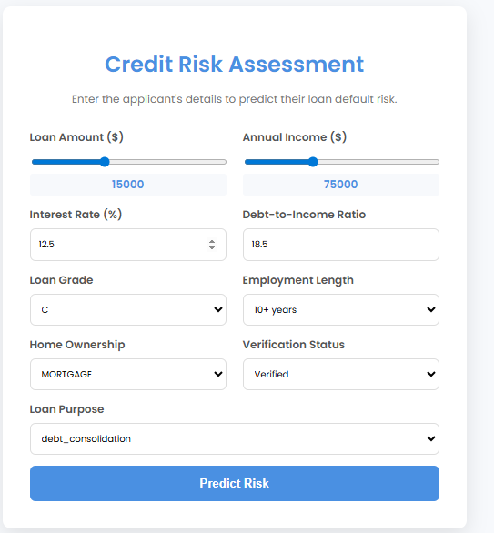

# Hybrid Deep Learning Model for Credit Risk Assessment

This project is a complete, end-to-end data science application that predicts the probability of a loan default. It uses a sophisticated hybrid deep learning model to analyze both structured financial data and unstructured text from loan applications. The final model is deployed as an interactive web application with built-in model explainability.



---
## Features

-   **Interactive UI:** A user-friendly web interface built with HTML, CSS, and JavaScript, featuring sliders and dropdowns for easy data entry.
-   **Real-Time Prediction:** The Flask backend serves a trained TensorFlow/Keras model to provide instant risk assessments.
-   **Model Explainability (XAI):** After a prediction, the app uses SHAP (SHapley Additive exPlanations) to display the top factors that influenced the model's decision in plain, easy-to-understand English.
-   **Dynamic Visual Feedback:** The prediction is displayed in a visual risk gauge that changes color based on the calculated risk level (Low, Medium, or High).

---
## Tech Stack

-   **Backend:** Python, Flask, TensorFlow, Keras, Scikit-learn, SHAP, Pandas, NumPy
-   **Frontend:** HTML, CSS, JavaScript (Fetch API)
-   **Development:** Jupyter Notebook, VS Code, Git
-   **Environment:** venv

---
## Setup and Installation

To run this project locally, please follow these steps:

1.  **Create and activate a virtual environment:**
    ```bash
    python -m venv venv
    .\venv\Scripts\activate
    ```

2.  **Install the required dependencies:**
    ```bash
    pip install -r requirements.txt
    ```

---
## Usage

1.  **Run the Flask API:**
    From the main project directory, start the backend server.
    ```bash
    python app.py
    ```
    Wait for the terminal to confirm that the model artifacts and SHAP explainer have loaded and the server is running on `http://127.0.0.1:5000`.

2.  **Launch the Frontend:**
    Navigate to the `frontend` folder and open the `index.html` file in your preferred web browser.

3.  Fill out the applicant's details in the form and click "Predict Risk" to see the prediction and its explanation.